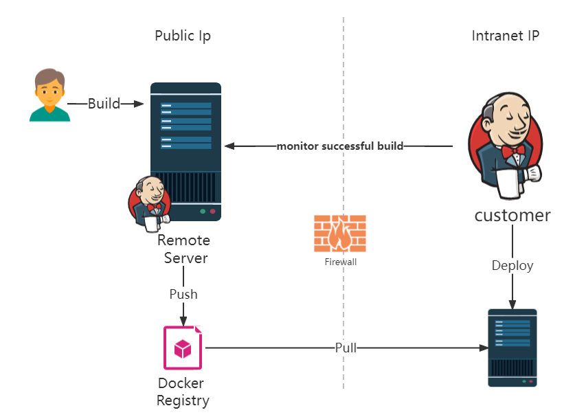
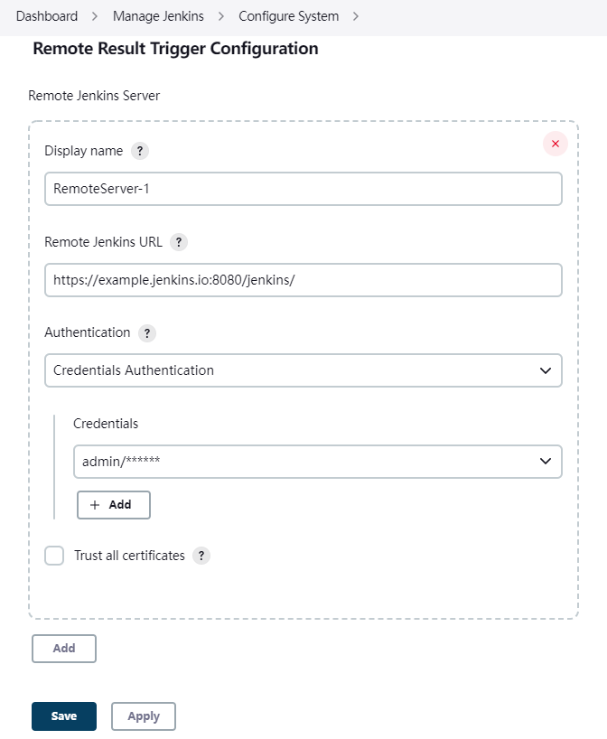
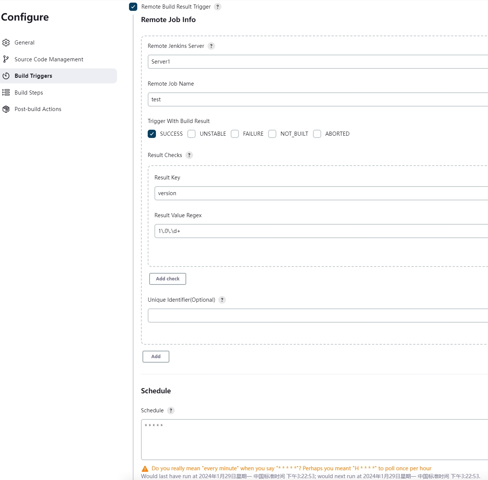
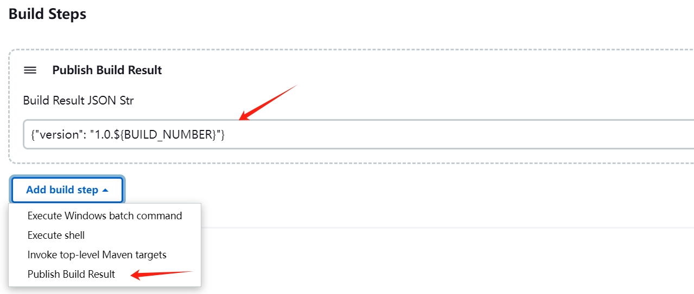

Remote-Build-Result-Trigger-Plugin
===================================

A plugin for Jenkins CI that gives you the ability to monitor successful build on a **remote** Jenkins server.

## Scenes

Build project and pull docker images on a remote server（having public ip）, Customer didn't having a public ip and we
dont want to share source code.



## Instructions

Enable the trigger within the "Remote Build Result Trigger" section of the build's configuration page.  
When remote server build successful, plugin will trigger a local build and inject remote envs to job.

| ENV_NAME                           | description                                                                                                                                       |
|------------------------------------|---------------------------------------------------------------------------------------------------------------------------------------------------|
| REMOTE_BUILD_NUMBER                | The remote build number, such as "153".                                                                                                           |  
| REMOTE_BUILD_TIMESTAMP             | The remote build timestamp, such as "1676017363424".                                                                                              |
| REMOTE_BUILD_URL                   | Full URL of this build, like [https://server:port/jenkins/job/foo/15/](https://server:port/jenkins/job/foo/15/) (<i>Jenkins URL</i> must be set). |
| REMOTE_BUILD_RESULT                | The remote build result, such as "SUCCESS", "UNSTABLE", "FAILURE", "NOT_BUILT", "ABORTED".                                                        |
| REMOTE_PARAMETER_${PARAMETER_NAME} | If remote job use buildWithParameters, use remote parameters replace ${PARAMETER_NAME}.                                                           |
| REMOTE_RESULT_${PUB_RESULT_KEY}    | If remote use pubResult, use result json key replace ${PUB_RESULT_KEY}                                                                            |
| REMOTE_JOBS                        | ex: ["Unique Identifier(Optional) \| Remote Job Name"]                                                                                            |

If monitor more than one remote job
> The **Unique Identifier(Optional)** used to replace injected envs, If didn't set, it will be replace with **Remote Job
Name**

| ENV_NAME                                   | description                                                                                                                                       |
|--------------------------------------------|---------------------------------------------------------------------------------------------------------------------------------------------------|
| REMOTE_JOBS                                | ex: ["Unique Identifier(Optional) \| Remote Job Name"]                                                                                            |
| REMOTE_${uid}_BUILD_NUMBER                 | The remote build number, such as "153".                                                                                                           |  
| REMOTE_${uid}_BUILD_TIMESTAMP              | The remote build timestamp, such as "1676017363424".                                                                                              |
| REMOTE_${uid}_BUILD_URL                    | Full URL of this build, like [https://server:port/jenkins/job/foo/15/](https://server:port/jenkins/job/foo/15/) (<i>Jenkins URL</i> must be set). |
| REMOTE_${uid}_BUILD_RESULT                 | The remote build result, such as "SUCCESS", "UNSTABLE", "FAILURE", "NOT_BUILT", "ABORTED".                                                        |
| REMOTE_${uid}\_PARAMETER_${PARAMETER_NAME} | If remote job use buildWithParameters, use remote parameters replace ${PARAMETER_NAME}.                                                           |
| REMOTE_${uid}\_RESULT_${PUB_RESULT_KEY}    | If remote use pubResult, use result json key replace ${PUB_RESULT_KEY}                                                                            |

## Configuration

### Add Remote Server

Manage Jenkins > Configure System > Remote Result Trigger Configuration > Remote Jenkins Server  


### Set Build Trigger

Job > Build Triggers > Checked Remote Build Result Trigger  


## Publish

### Publish with pipeline

```groovy
pubResult(result: '{"key": "value"}')
```

### Publish with FreestyleProject

