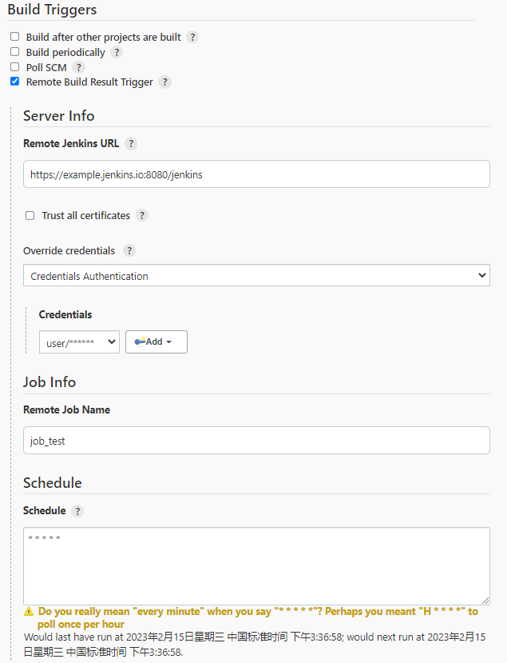

Remote-Build-Result-Trigger-Plugin
===================================

A plugin for Jenkins CI  that gives you the ability to monitor successful build on a **remote** Jenkins server.

## Instructions
Enable the trigger within the "Remote Build Result Trigger" section of the build's configuration page.

## Screenshot

