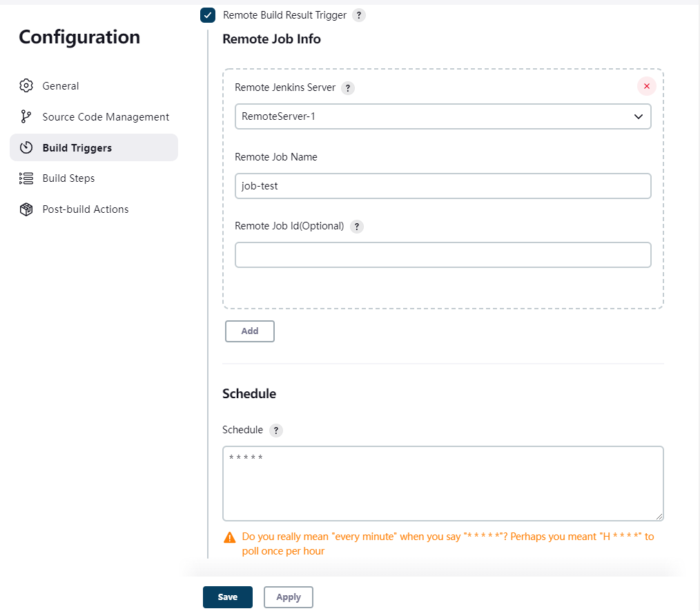

Remote-Build-Result-Trigger-Plugin
===================================

A plugin for Jenkins CI  that gives you the ability to monitor successful build on a **remote** Jenkins server.

## Scenes

Build project and pull docker images on a remote server（having public ip）, Customer didn't having a public ip and we dont want to share source code.

## Instructions
Enable the trigger within the "Remote Build Result Trigger" section of the build's configuration page.  
When remote server build successful, plugin will trigger a local build and inject remote envs to job.

| EVN_NAME                           | description                                                                                                                                       |
|------------------------------------|---------------------------------------------------------------------------------------------------------------------------------------------------|
| REMOTE_BUILD_NUMBER                | The remote build number, such as "153".                                                                                                           |  
| REMOTE_BUILD_TIMESTAMP             | The remote build timestamp, such as "1676017363424".                                                                                              |
| REMOTE_BUILD_URL                   | Full URL of this build, like [https://server:port/jenkins/job/foo/15/](https://server:port/jenkins/job/foo/15/) (<i>Jenkins URL</i> must be set). |
| REMOTE_JOB_NAME                    | The Configuration of  **Remote Job Name**                                                                                                         |
| REMOTE_JOB_ID                      | The Configuration of  **Remote Job Id(Optional)**                                                                                                 |
| REMOTE_PARAMETER_${PARAMETER_NAME} | If remote job use buildWithParameters, use remote parameters replace ${PARAMETER_NAME}.                                                           |

If monitor more than one remote job

| EVN_NAME                                          | description                                                                                                                                       |
|---------------------------------------------------|---------------------------------------------------------------------------------------------------------------------------------------------------|
| REMOTE_${RemoteJobId}_BUILD_NUMBER                | The remote build number, such as "153".                                                                                                           |  
| REMOTE_${RemoteJobId}_BUILD_TIMESTAMP             | The remote build timestamp, such as "1676017363424".                                                                                              |
| REMOTE_${RemoteJobId}_BUILD_URL                   | Full URL of this build, like [https://server:port/jenkins/job/foo/15/](https://server:port/jenkins/job/foo/15/) (<i>Jenkins URL</i> must be set). |
| REMOTE_${RemoteJobId}_JOB_NAME                    | The Configuration of  **Remote Job Name**                                                                                                         |
| REMOTE_${RemoteJobId}_JOB_ID                      | The Configuration of  **Remote Job Id(Optional)**                                                                                                 |
| REMOTE_${RemoteJobId}_PARAMETER_${PARAMETER_NAME} | If remote job use buildWithParameters, use remote parameters replace ${PARAMETER_NAME}.                                                           |

## Configuration
### Add Remote Server  
Manage Jenkins > Configure System > Remote Result Trigger Configuration > Remote Jenkins Server

### Set Build Trigger
Job > Build Triggers > Checked Remote Build Result Trigger

